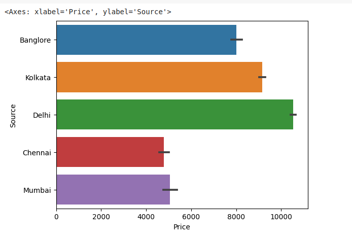
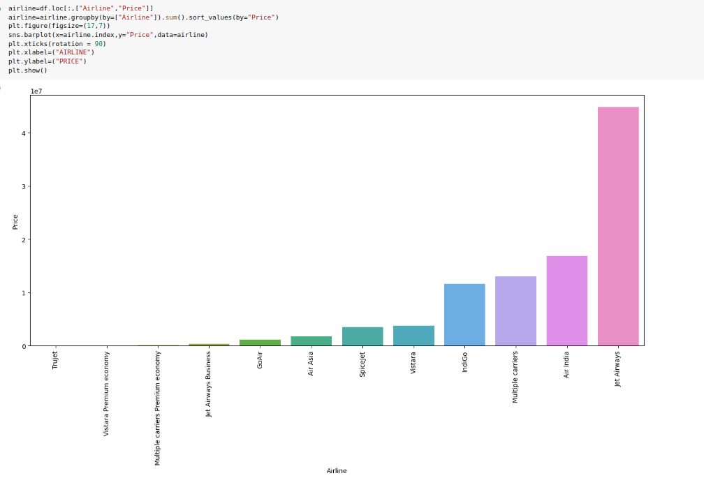
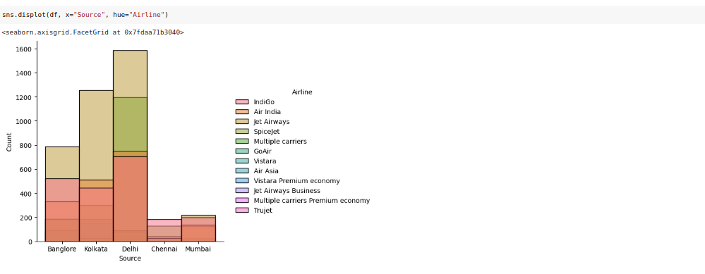
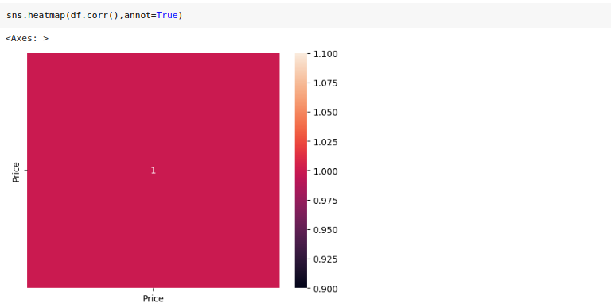

# workshop-Multivariate-analysis:

## AIM:

 To perform Bivariate/Multivariate Analysis for the given data set.

## Algorithm:

## Step 1:

1.Read the given data

## Step2:

2.Get information from the data

## Step3:

3.Perform the Multivariate Analysis

## Step4:

4.Save the clean data to file


## Code:

```
import pandas as pd
import numpy as np
import matplotlib.pyplot as plt
import seaborn as sns
df=pd.read_excel("/content/FlightInformation.xlsx")
df.head()
df.isnull().sum()
df.info()
df['Route']=df['Route'].fillna(df['Route'].mode()[0])
df['Total_Stops']=df['Total_Stops'].fillna(df['Total_Stops'].mode()[0])
sns.scatterplot(df['Duration'],df['Destination'])
sns.barplot(x=df["Price"],y=df["Source"],data=df)
airline=df.loc[:,["Airline","Price"]]
airline=airline.groupby(by=["Airline"]).sum().sort_values(by="Price")
plt.figure(figsize=(17,7))
sns.barplot(x=airline.index,y="Price",data=airline)
plt.xticks(rotation = 90)
plt.xlabel=("AIRLINE")
plt.ylabel=("PRICE")
plt.show()
sns.boxplot(df['Price'],df['Duration'])
sns.displot(df, x="Source", hue="Airline")
df.corr()
sns.heatmap(df.corr(),annot=True)
```
## Output:


## FINDING NULL VALUES:


## PERFORMING MODE:


## NUMERICAL & CATEGORICAL:

## 1) BARPLOT:



## 2)BOXPLOT:




## 3) DISPLOT:



## MULTIVARIATE ANALYSIS:

## CORRELATION:


## HEATMAP:




## RESULT:

Thus the Bivariate/Multivariate Analysis for the given data set is executed successfully.